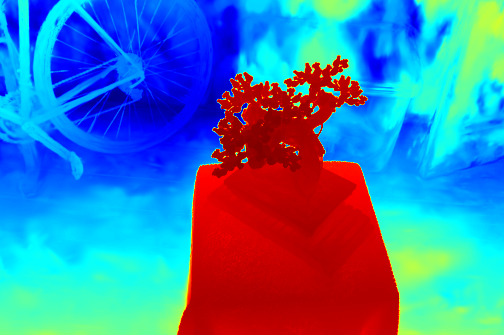

# Differential Gaussian Rasterization with Depth Forward and Backward Functionality

## About

An extension of the rasterization engine for the paper "3D Gaussian Splatting for Real-Time Rendering of Radiance Fields". 

We make two contributions: 
* Depth forward: render depth map, weight map, along with color map 
* Depth backward: backpropagate the graidents from depth loss to Gaussians.

Note that our method calculates depth values based on volume rendering, and  corrects the depth by **dividing it by the weights** of volume rendering. You can apply supervision to them, such as depth  monocular estimation. If you do not wish to correct the depth, you can obtain the uncorrected  depth map by multiplying the depth map with the weight map.

**We have verified its correctness on real datasets under sparse view setting (e.g., 3 views), by supervising the optimization with monocular depth.**

Result of dataset `360v2 bonsai` : 

<div><table frame=void>
	<tr>
        <td><div><center>
        	
        	<br>
        	rendered image
        </center></div></td>    
     	<td><div><center>
    		
    		<br>
    		depth map
        </center></div></td>
    </div><table frame=void>

## Install

```shell
git clone git@github.com:leo-frank/diff-gaussian-rasterization-depth.git
cd diff-gaussian-rasterization-depth
python setup.py install
```


## Usage

```python
from diff_gaussian_rasterization_depth import GaussianRasterizationSettings, GaussianRasterizer

...

raster_settings = ...
rasterizer = GaussianRasterizer(raster_settings=raster_settings)    

rendered_image, radii, depth_map, weight_map = rasterizer(
    means3D = means3D, 
    means2D = means2D,  
    shs = shs,          
    colors_precomp = colors_precomp,
    opacities = opacity, 
    scales = scales,   
    rotations = rotations,  
    cov3D_precomp = cov3D_precomp,
)

...
```


<section class="section" id="BibTeX">
  <div class="container is-max-desktop content">
    <h2 class="title">BibTeX</h2>
    <pre><code>@Article{kerbl3Dgaussians,
      author       = {Kerbl, Bernhard and Kopanas, Georgios and Leimk{\"u}hler, Thomas and Drettakis, George},
      title        = {3D Gaussian Splatting for Real-Time Radiance Field Rendering},
      journal      = {ACM Transactions on Graphics},
      number       = {4},
      volume       = {42},
      month        = {July},
      year         = {2023},
      url          = {https://repo-sam.inria.fr/fungraph/3d-gaussian-splatting/}
}</code></pre>
  </div>
</section>
